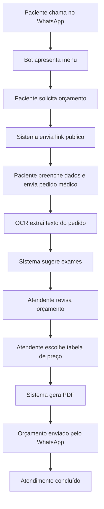
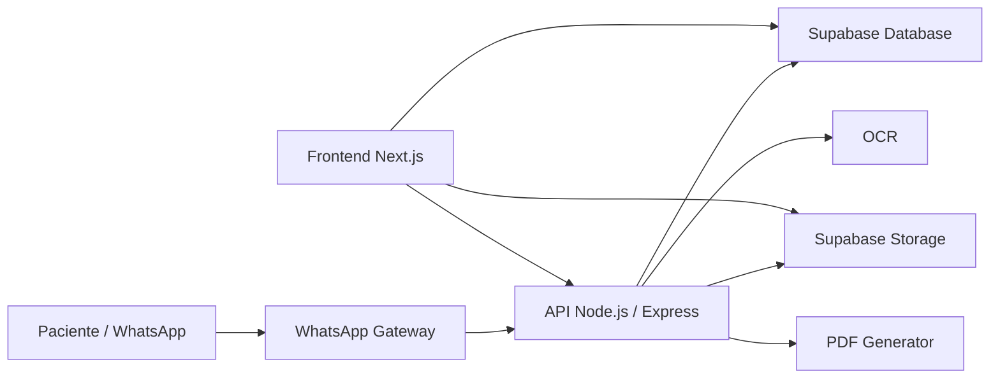
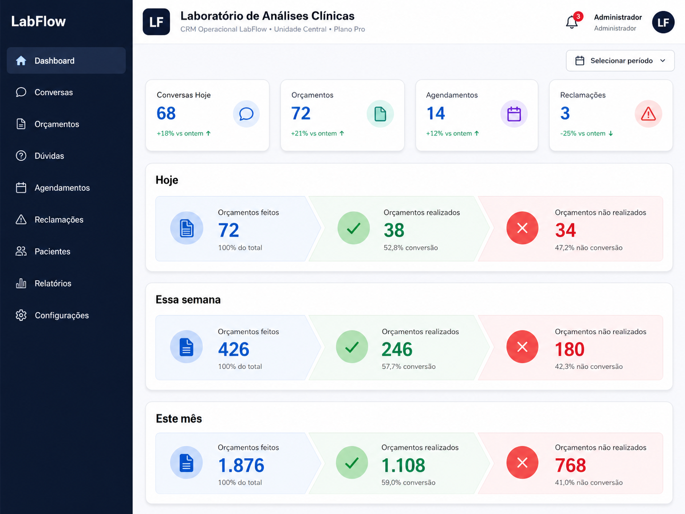
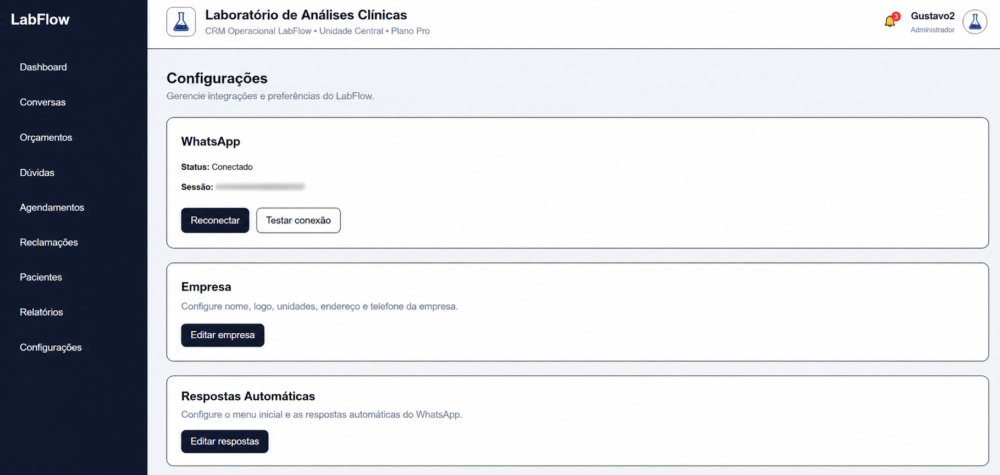

# LabFlow — CRM e Automação para Laboratórios Clínicos

> Case study público de uma plataforma desenvolvida para organizar atendimentos via WhatsApp, automatizar solicitações de orçamento, ler pedidos médicos com OCR e gerar orçamentos em PDF para laboratórios de análises clínicas.

## Visão geral

O **LabFlow** é uma plataforma web criada para centralizar e automatizar parte da operação comercial e de atendimento de laboratórios clínicos.

O sistema foi pensado para resolver problemas comuns na rotina de laboratórios:

* Alto volume de mensagens no WhatsApp.
* Solicitações de orçamento feitas manualmente.
* Dificuldade para organizar conversas por tipo de atendimento.
* Necessidade de padronizar respostas automáticas.
* Orçamentos baseados em pedidos médicos enviados por foto ou PDF.
* Diferentes tabelas de preço, como particular, aposentados e convênios.
* Falta de um painel simples para acompanhamento operacional.

A solução combina **CRM**, **automação de WhatsApp**, **OCR**, **geração de PDF**, **controle de usuários**, **multiempresa** e **configurações administrativas**.

---

## Objetivo do projeto

Criar uma plataforma SaaS/CRM para laboratórios de análises clínicas, permitindo que a equipe consiga:

1. Receber e organizar mensagens vindas do WhatsApp.
2. Classificar conversas por tipo de atendimento.
3. Enviar links públicos para solicitação de orçamento.
4. Receber pedido médico por imagem ou PDF.
5. Ler automaticamente o pedido médico com OCR.
6. Sugerir exames encontrados no pedido.
7. Permitir revisão manual dos exames.
8. Gerar orçamento em PDF.
9. Enviar o orçamento pelo WhatsApp.
10. Configurar respostas automáticas e dados da empresa.
11. Trabalhar com tabelas de preço diferentes, como particular e aposentados.

---

## Stack utilizada

### Frontend

* Next.js
* React
* TypeScript
* Tailwind CSS
* Vercel

### Backend

* Node.js
* Express
* TypeScript
* Render

### Banco e autenticação

* Supabase
* Supabase Auth
* Supabase Database
* Supabase Storage

### Integrações e automações

* WhatsApp Gateway
* OCR para leitura de pedidos médicos
* Google Sheets como base inicial de exames
* Geração de PDF

---

## Principais funcionalidades

### Autenticação e controle de acesso

A plataforma possui login, cadastro, perfil de usuário e controle básico de permissões.

Perfis previstos:

* Administrador
* Recepção
* Super administrador

Cada usuário fica vinculado a uma organização e, opcionalmente, a uma unidade do laboratório.

---

### Painel operacional

O painel centraliza os principais módulos da operação:

* Dashboard
* Conversas
* Orçamentos
* Dúvidas
* Agendamentos
* Reclamações
* Pacientes
* Relatórios
* Configurações

---

### Conversas via WhatsApp

O sistema recebe mensagens vindas do WhatsApp e organiza os atendimentos em um painel.

As conversas podem ser classificadas por contexto, como:

* Orçamento
* Agendamento
* Dúvida
* Reclamação
* Atendimento humano

---

### Solicitação pública de orçamento

O paciente recebe um link público para solicitar orçamento.

Nesse link, ele pode:

* Informar nome e data de nascimento.
* Enviar foto ou PDF do pedido médico.
* Selecionar exames manualmente.
* Indicar se é aposentado.
* Informar se possui convênio.
* Enviar a solicitação para análise da equipe.

---

### OCR de pedido médico

Ao enviar o pedido médico, o sistema realiza leitura automática do arquivo e tenta identificar os exames solicitados.

O fluxo é:

1. Paciente envia imagem ou PDF.
2. Sistema salva o arquivo.
3. OCR extrai o texto.
4. O texto é limpo e analisado.
5. O sistema sugere exames compatíveis.
6. O atendente revisa a lista antes de gerar o orçamento.

---

### Edição de orçamento

A equipe pode revisar e editar o orçamento antes de gerar o PDF.

Na tela de edição é possível:

* Alterar dados do paciente.
* Visualizar texto extraído pelo OCR.
* Abrir o pedido médico original.
* Adicionar exames.
* Remover exames.
* Alterar tabela de preço.
* Salvar alterações.

---

### Tabelas de preço

O sistema foi preparado para trabalhar com diferentes tabelas de preço.

Exemplos:

* Particular
* Aposentados / AAPI
* Convênios
* Tabelas personalizadas

Na área pública, o paciente não vê nomes internos como “PART” ou “AAPI”. Ele apenas informa se é aposentado ou se possui convênio.

Internamente, o sistema seleciona a tabela correta para calcular o orçamento.

---

### Geração de PDF

Após revisão dos exames, o sistema gera um PDF de orçamento com:

* Dados do paciente.
* Lista de exames.
* Prazo.
* Jejum.
* Valores.
* Total do orçamento.
* Identidade visual do laboratório.

---

### Envio pelo WhatsApp

Depois de gerar o PDF, a equipe pode enviar o orçamento ao paciente pelo WhatsApp diretamente pelo painel.

---

### Reclamações e ouvidoria

O sistema também possui fluxo para reclamações/ouvidoria, permitindo gerar link público para o paciente registrar uma manifestação.

---

### Configurações da empresa

Administradores podem configurar informações da empresa, como:

* Nome do laboratório.
* Logo.
* Unidades.
* Endereço.
* Telefone.
* Unidade padrão.

---

## Fluxo operacional

---

## Arquitetura simplificada

---

## Screenshots

### Login

> Inserir print da tela de login.

---

### Dashboard

> Inserir print do dashboard principal.

---

### Conversas

> Inserir print da listagem de conversas.

---

### Solicitação pública de orçamento

> Inserir print do link público usado pelo paciente.

---

### OCR e sugestão de exames

> Inserir print mostrando o texto lido e os exames identificados.

---

### Edição de orçamento

> Inserir print da tela de edição de orçamento.

---

### Detalhes do orçamento

> Inserir print do orçamento gerado no painel.

---

### Configurações

> Inserir print da tela de configurações da empresa.

---

## Desafios técnicos resolvidos

### 1. Integração com WhatsApp

O projeto exigiu a criação de um fluxo em que mensagens recebidas pelo WhatsApp fossem organizadas em conversas no painel, preservando contexto e permitindo transição para atendimento humano.

### 2. OCR para pedidos médicos

A leitura automática de pedidos médicos exigiu tratamento de texto, normalização, identificação de termos e correspondência com uma base de exames.

### 3. Matching de exames

O sistema cruza o texto extraído com a base de exames, considerando sinônimos, abreviações, nomes populares e termos equivalentes.

### 4. Tabelas de preço

O orçamento precisava suportar tabelas diferentes, como particular e aposentados, sem expor termos internos para o paciente.

### 5. Multiempresa

A estrutura foi preparada para reaproveitamento em outros laboratórios, com organização, unidade, usuários e configurações separadas.

---

## Status do projeto

O projeto está em fase de MVP funcional/piloto operacional.

Funcionalidades já implementadas:

* Login e cadastro.
* Painel operacional.
* Gestão de conversas.
* Solicitação pública de orçamento.
* Upload de pedido médico.
* OCR.
* Sugestão de exames.
* Edição de orçamento.
* Tabelas de preço.
* Geração de PDF.
* Envio por WhatsApp.
* Configurações da empresa.
* Reclamações/ouvidoria.

Próximos passos planejados:

* Painel completo para editar tabelas de exames.
* Importação de tabelas por Excel.
* Base de conhecimento para agente IA.
* Treinamento de respostas personalizadas.
* Relatórios operacionais.
* Indicadores de atendimento e conversão.

---

## Observação

Este repositório é um **case study público**.

O código-fonte completo da aplicação permanece privado por conter regras de negócio, integrações, automações e estrutura comercial do produto.

As imagens e dados apresentados devem utilizar informações fictícias ou anonimizadas.
