# LabFlow — CRM e Automação para Laboratórios Clínicos

> Case study público de uma plataforma criada para centralizar atendimentos via WhatsApp, automatizar solicitações de orçamento, ler pedidos médicos com OCR e gerar orçamentos em PDF para laboratórios de análises clínicas.

---

## Visão geral

O **LabFlow** é uma plataforma web voltada para laboratórios clínicos que precisam organizar atendimentos, reduzir trabalho manual e acompanhar melhor o fluxo comercial vindo do WhatsApp.

A solução combina:

* CRM de conversas;
* automação de WhatsApp;
* solicitação pública de orçamento;
* leitura de pedido médico com OCR;
* revisão manual de exames;
* tabelas de preço;
* geração de PDF;
* envio de orçamento pelo WhatsApp;
* configurações administrativas;
* estrutura multiempresa.

---

## Problema

Laboratórios recebem muitas solicitações pelo WhatsApp e, na prática, grande parte do processo ainda é manual:

* pacientes enviam fotos de pedidos médicos;
* a recepção precisa interpretar exames;
* valores são consultados em tabelas separadas;
* orçamentos são montados manualmente;
* conversas ficam espalhadas no WhatsApp;
* faltam indicadores de conversão e acompanhamento.

O LabFlow foi criado para transformar esse fluxo em um processo mais organizado, rastreável e automatizado.

---

## Stack utilizada

| Camada             | Tecnologias                                                  |
| ------------------ | ------------------------------------------------------------ |
| Frontend           | Next.js, React, TypeScript, Tailwind CSS, Vercel             |
| Backend            | Node.js, Express, TypeScript, Render                         |
| Banco/Auth/Storage | Supabase, Supabase Auth, Supabase Database, Supabase Storage |
| Integrações        | WhatsApp Gateway, OCR, Google Sheets, geração de PDF         |

---

## Principais funcionalidades

* Cadastro e login com vínculo por empresa, unidade e função.
* Painel operacional com dashboard, conversas, orçamentos e configurações.
* Central de conversas recebidas pelo WhatsApp.
* Controle para ativar/desativar robô por conversa.
* Atendimento humano diretamente pelo painel.
* Link público para solicitação de orçamento.
* Upload de foto/PDF do pedido médico.
* Leitura automática do pedido com OCR.
* Sugestão automática de exames identificados.
* Seleção manual de exames.
* Revisão e edição dos orçamentos.
* Tabelas de preço como Particular, AAPI e futuras tabelas de convênios.
* Geração de PDF personalizado.
* Envio do orçamento pelo WhatsApp.
* Configurações de empresa, WhatsApp e respostas automáticas.

---

## Fluxo operacional

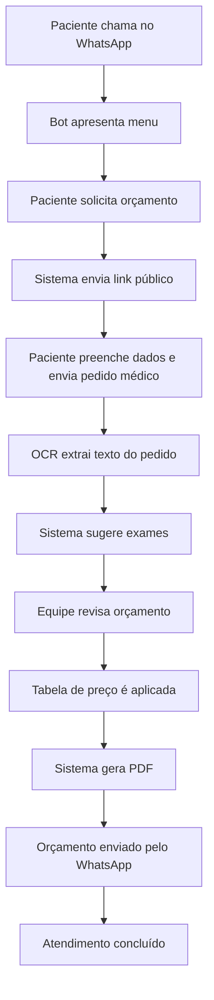

---

## Arquitetura simplificada

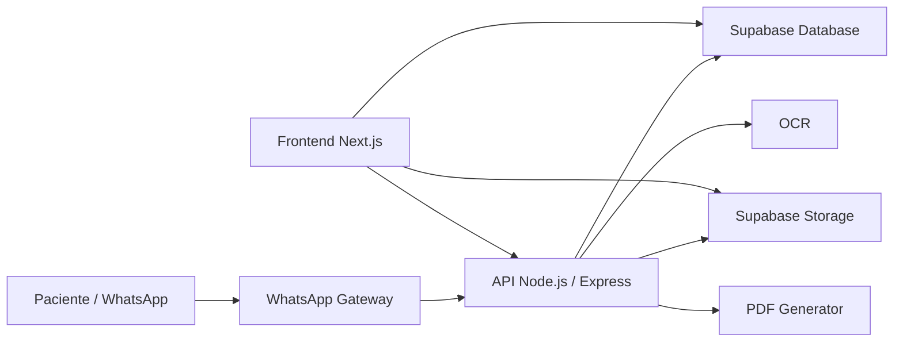

---

# Demonstração da plataforma

## Cadastro e vínculo com empresa

A tela de cadastro permite criar usuários vinculados a uma empresa, unidade e função operacional, preparando o sistema para uso multiempresa.

Perfis como **administrador** e **recepção** podem ter acessos diferentes dentro do painel.

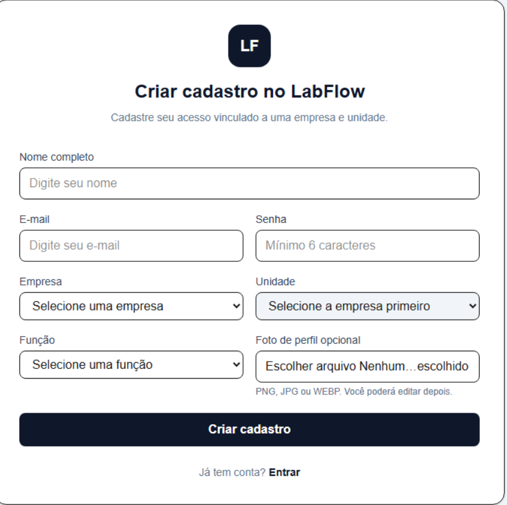

---

## Dashboard gerencial

O dashboard apresenta uma visão executiva da operação, com métricas de conversas, orçamentos, agendamentos, reclamações e funil comercial.

Além dos indicadores gerais, o painel pode acompanhar:

* orçamentos feitos;
* orçamentos realizados;
* orçamentos não realizados;
* taxa de conversão;
* desempenho diário, semanal e mensal;
* oportunidades de follow-up.

Ao clicar em orçamentos não realizados, a equipe pode acessar os pacientes pendentes, visualizar detalhes do orçamento e acionar um follow-up automático pelo WhatsApp.

Exemplo de mensagem:

> Olá! Tudo bem? 😊
> Passando para lembrar sobre o orçamento dos seus exames.
> Caso ainda tenha interesse, estamos à disposição para ajudar com o agendamento e esclarecer qualquer dúvida.
> Se desejar dar continuidade, podemos verificar uma condição especial para facilitar a realização dos exames.

---

## Gestão de conversas

O LabFlow centraliza as conversas recebidas pelo WhatsApp em um painel operacional.

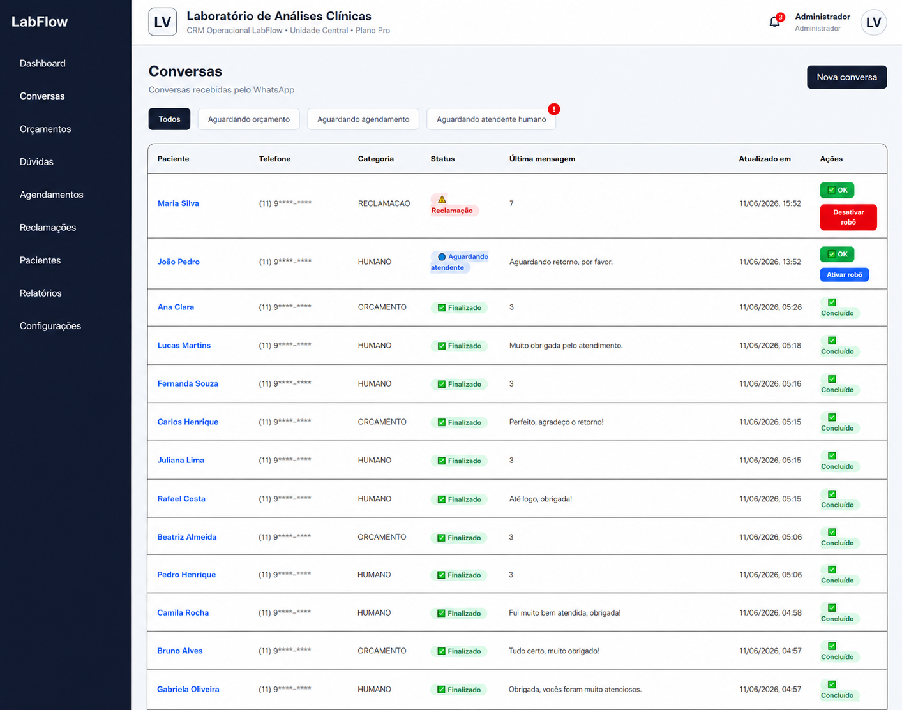

Na listagem, a equipe consegue visualizar:

* paciente;
* telefone anonimizado;
* categoria;
* status;
* última mensagem;
* data de atualização;
* ações disponíveis.

Também é possível filtrar conversas por situação, como **aguardando orçamento**, **aguardando agendamento** ou **aguardando atendente humano**.

O painel permite controlar o robô por conversa:

* **Ativar robô:** retorna o atendimento para o fluxo automatizado.
* **Desativar robô:** pausa o bot para atendimento manual.
* **Abrir conversa:** permite ver o histórico e responder pelo painel.
* **Concluir atendimento:** finaliza a solicitação.

---

## Atendimento individual

Ao abrir uma conversa, o atendente visualiza o histórico completo e pode responder diretamente pelo painel.

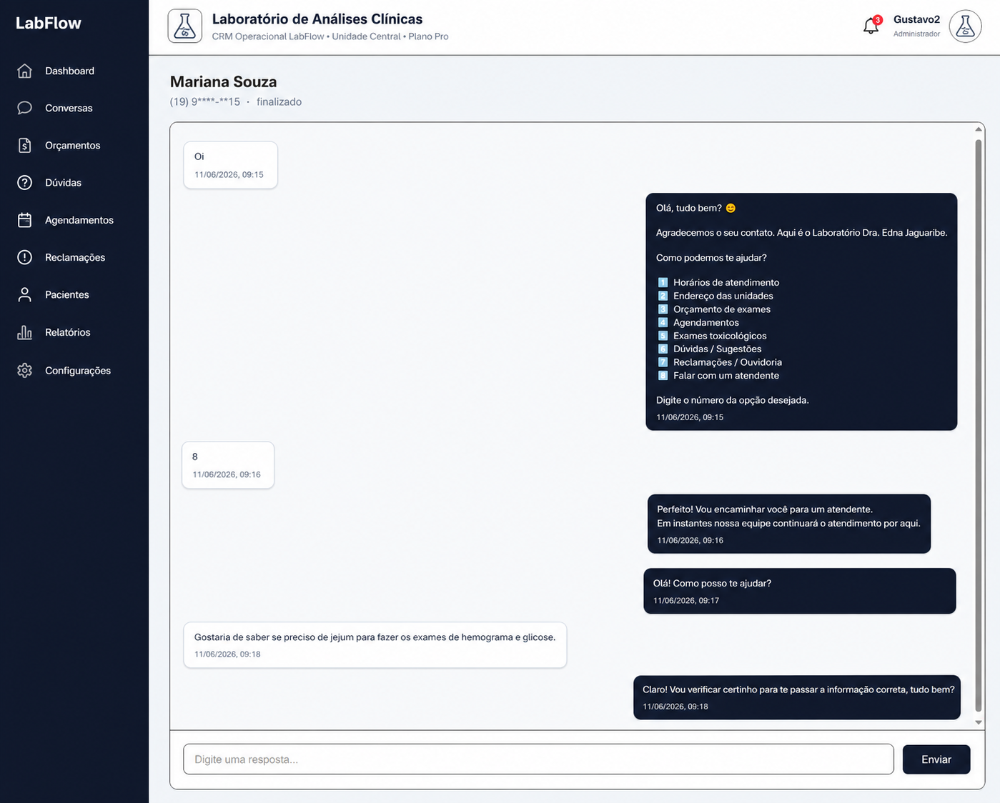

O fluxo pode começar com o bot enviando o menu inicial. Quando o paciente escolhe falar com um atendente, o sistema sinaliza a conversa para atendimento humano.

Isso permite combinar automação com atendimento personalizado: o robô resolve etapas repetitivas, enquanto a equipe assume casos específicos, dúvidas sensíveis ou oportunidades comerciais.

---

## Solicitação pública de orçamento

O paciente pode receber um link público para solicitar orçamento sem depender de troca manual de mensagens.

Na primeira etapa, ele escolhe entre:

* enviar foto/PDF do pedido médico;
* selecionar exames manualmente.

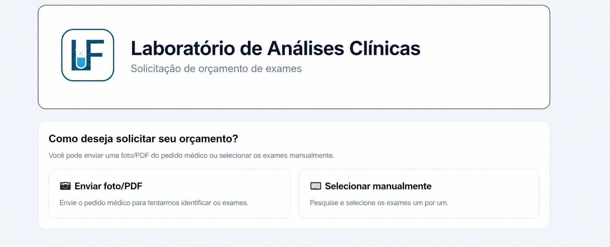

---

## Preenchimento e seleção de exames

O paciente informa seus dados básicos e pode selecionar condições especiais, como aposentado ou convênio.

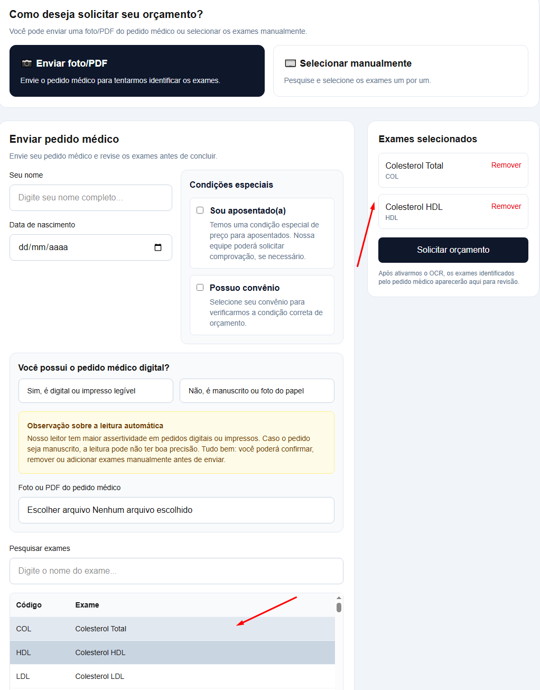

Ao selecionar exames manualmente, os itens aparecem na lateral em **Exames selecionados**, permitindo revisar, remover ou complementar a lista antes do envio.

---

## Upload do pedido médico

Além da seleção manual, o paciente pode enviar foto ou PDF do pedido médico.

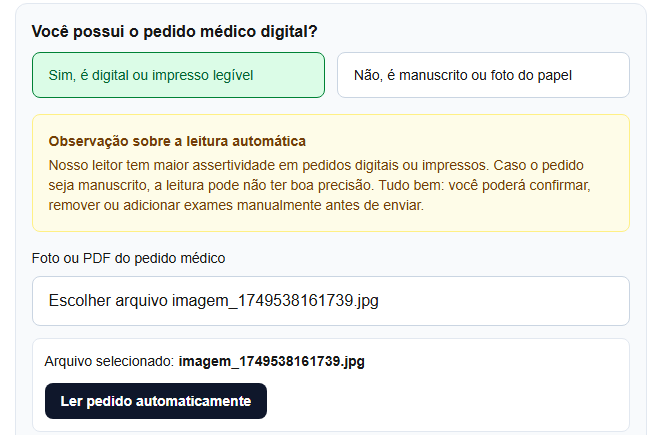

O sistema orienta o paciente sobre a qualidade do arquivo, já que pedidos digitais ou impressos legíveis tendem a ter melhor leitura automática.

---

## OCR e identificação dos exames

Após o upload, o LabFlow realiza a leitura automática do pedido médico.

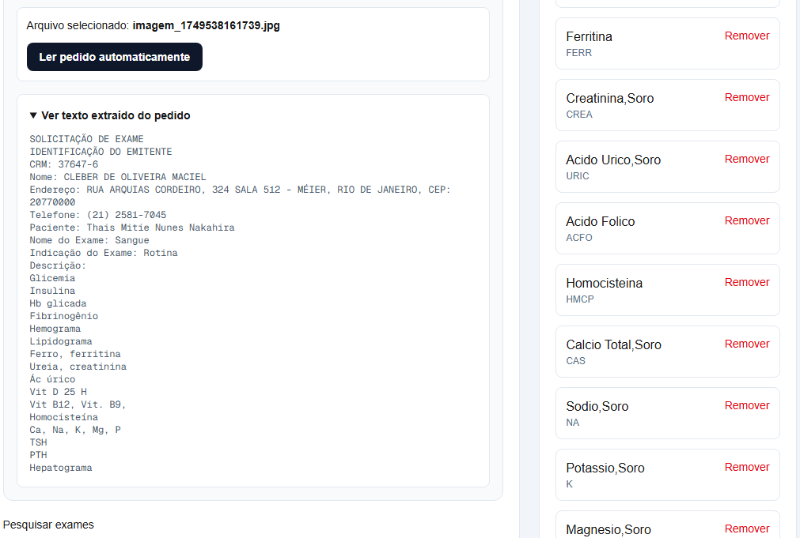

O sistema extrai o texto do documento, cruza os termos com a base de exames e sugere os exames encontrados. Mesmo quando a leitura não é perfeita, a equipe pode revisar, remover ou adicionar itens antes de finalizar.

---

## Gestão interna de orçamentos

Depois que o paciente envia a solicitação, o orçamento aparece automaticamente no painel interno.

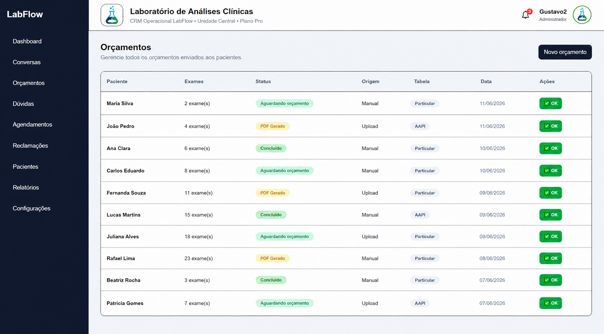

A equipe consegue acompanhar:

* paciente;
* quantidade de exames;
* status;
* origem da solicitação;
* tabela aplicada;
* data;
* ações disponíveis.

A origem pode ser **Upload**, quando veio de um pedido médico, ou **Manual**, quando os exames foram selecionados diretamente.

---

## Detalhes do orçamento

Ao abrir um orçamento, o atendente visualiza os dados completos antes de enviar ao paciente.

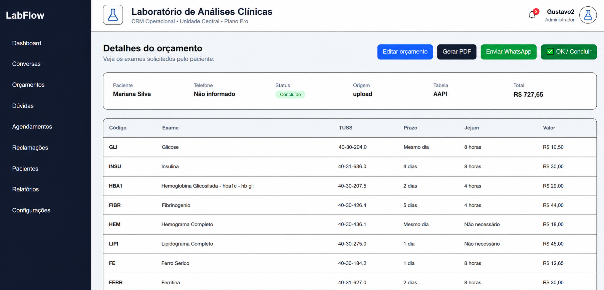

A tela mostra:

* dados do paciente;
* status;
* origem;
* tabela de preço;
* valor total;
* lista de exames;
* código interno;
* TUSS;
* prazo;
* jejum;
* valor individual.

A partir dela, é possível editar o orçamento, gerar PDF, enviar pelo WhatsApp e concluir o atendimento.

---

## Edição e revisão do orçamento

Antes de gerar o PDF, a equipe pode revisar o orçamento.

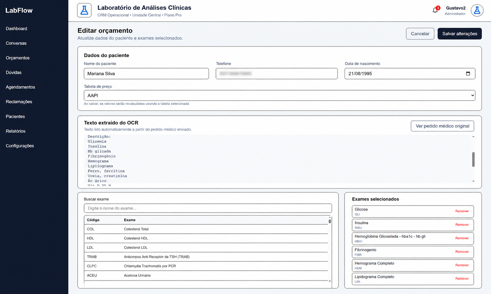

Na edição, o atendente pode:

* alterar dados do paciente;
* trocar a tabela de preço;
* visualizar o texto extraído pelo OCR;
* abrir o pedido médico original;
* adicionar ou remover exames;
* recalcular valores;
* salvar alterações.

A troca de tabela permite recalcular o orçamento conforme a condição correta, como Particular, AAPI ou futuras tabelas de convênios.

---

## PDF personalizado e envio pelo WhatsApp

Após a revisão, o sistema gera um PDF personalizado com identidade visual do laboratório, dados do paciente, exames, prazos, jejum, valores individuais e total.

Em seguida, o orçamento pode ser enviado diretamente pelo WhatsApp para o paciente que realizou a solicitação.

Esse fluxo reduz retrabalho, evita montagem manual de PDF e mantém o histórico do atendimento centralizado.

---

## Configurações do sistema

A área de configurações centraliza ajustes operacionais da plataforma.

Nela, o administrador pode acompanhar a integração com WhatsApp, testar conexão, reconectar a sessão, editar dados da empresa e configurar respostas automáticas.

Essa área também serve como base para futuras configurações administrativas, como:

* tabelas de preço;
* convênios;
* unidades;
* permissões;
* modelos de PDF;
* horários de atendimento;
* regras comerciais;
* integrações externas.

---

## Diferenciais técnicos

### WhatsApp integrado ao painel

As mensagens recebidas pelo WhatsApp são registradas no painel, com controle de status, categoria e transição entre robô e atendimento humano.

### OCR aplicado a pedidos médicos

O sistema extrai texto de imagens ou PDFs de pedidos médicos e tenta identificar os exames solicitados automaticamente.

### Matching de exames

Os termos lidos pelo OCR são cruzados com a base de exames, permitindo sugerir exames ao paciente ou à equipe.

### Tabelas de preço

O orçamento suporta diferentes tabelas, como Particular e AAPI, sem expor termos internos para o paciente na área pública.

### Estrutura multiempresa

A plataforma foi preparada para reaproveitamento em outros laboratórios, separando organização, unidade, usuários e configurações.

---

## Status do projeto

O projeto está em fase de MVP funcional e piloto operacional.

### Implementado

* Login e cadastro.
* Painel operacional.
* Conversas via WhatsApp.
* Atendimento humano pelo painel.
* Solicitação pública de orçamento.
* Upload de pedido médico.
* OCR.
* Sugestão de exames.
* Edição de orçamento.
* Tabelas de preço.
* Geração de PDF.
* Envio pelo WhatsApp.
* Configurações da empresa.
* Reclamações/ouvidoria.

### Próximos passos

* Painel completo para editar tabelas de exames.
* Importação de tabelas por Excel/XML.
* Base de conhecimento para agente IA.
* Respostas personalizadas por empresa.
* Relatórios operacionais avançados.
* Indicadores de conversão e follow-up.

---

## Observação

Este repositório é um **case study público**.

O código-fonte completo da aplicação permanece privado por conter regras de negócio, integrações, automações e estrutura comercial do produto.

As imagens e dados apresentados neste case utilizam informações fictícias ou anonimizadas.
